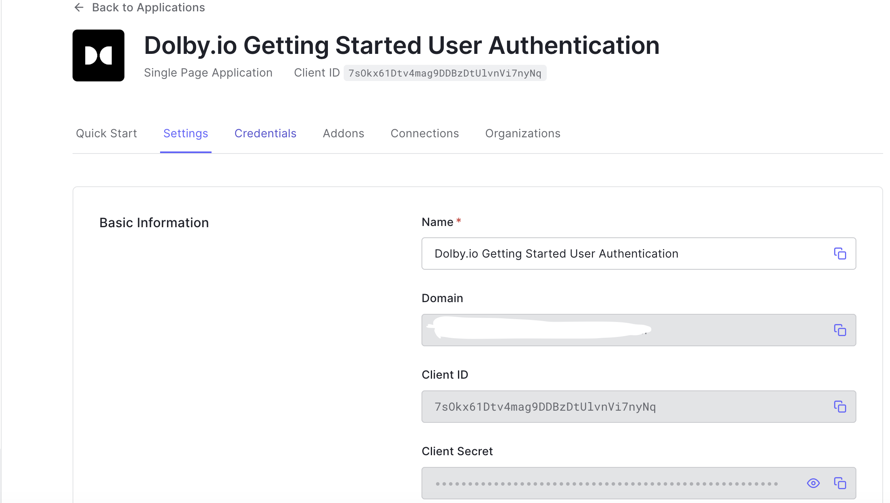
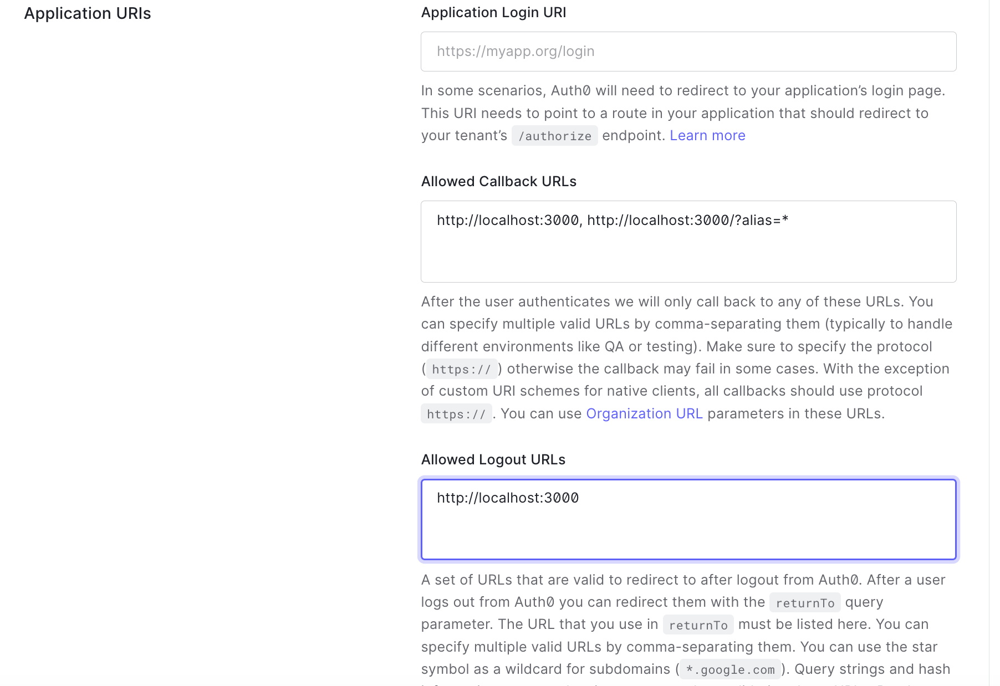
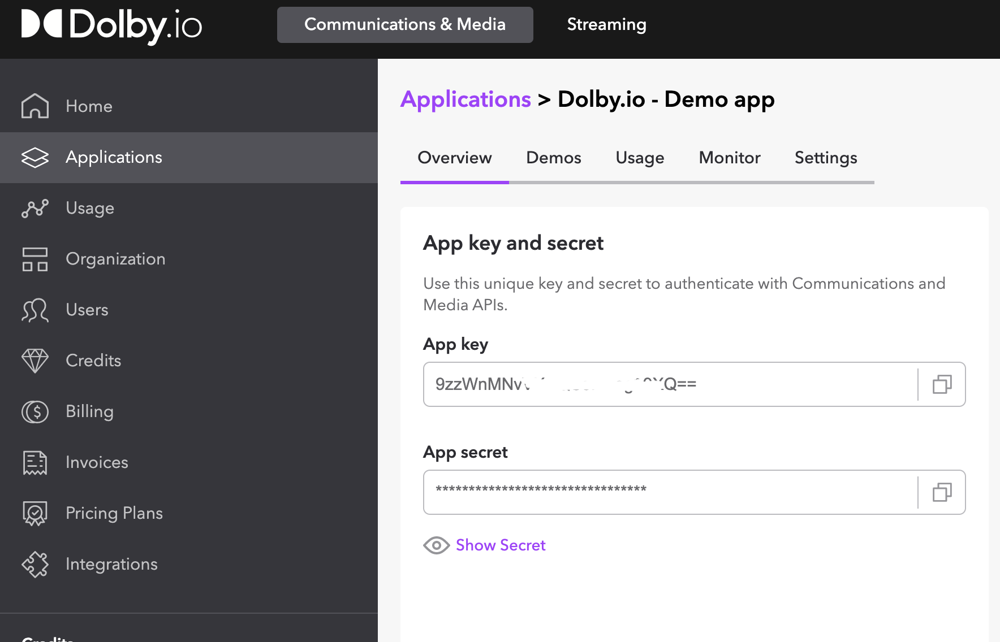

# Dolby.io Communications Web SDK -- Getting Started with User Authentication using Auth0

This starter project demonstrates the mechanics of making a Voice and Video Call with Dolby.io and allowing only authenticated users to access to your application using Auth0's Universal Login Page.

## Running the Sample Application

The sample can be run locally, by cloning the repository to your machine and then following the steps below.

### Create a free Auth0 account and set a Single Page Application

1. Go to [Auth0](https://auth0.com/signup) and click Sign Up.
2. Use Google, GitHub or Microsoft Account to login.
3. Get Your Application Keys:
  When you signed up for Auth0, a new application was created for you, or you could have created a new one. You will need some details about that application to communicate with Auth0. You can get these details from the Application Settings section in the Auth0 dashboard.

4. You will use the Domain  & Client ID information to fill the `auth_config.json` with the Dolby.io creditentials that you'll learn how to obtain in the next steps.

   

    **Note**: When using the Default App with a Native or Single Page Application, ensure to update the Token Endpoint Authentication Method to None and set the Application Type to either SPA or Native.

5. Configure Callback URLs:
A callback URL is a URL in your application where Auth0 redirects the user after they have authenticated. The callback URL for your app must be added to the Allowed Callback URLs field in your Application Settings. If this field is not set, users will be unable to log in to the application and will get an error.
    > If you are following along with the sample project you downloaded from the top of this page, you should set the Allowed Callback URL to http://localhost:3000 if you don't want to specify a conference alias. It'll automatically set it to `web-sdk-starter`. If there's a conference alias you would like to give as a query parameter in the URL, add http://localhost:3000/?alias=* to the Callback URLs.

    

6. Configure Logout URLs: A logout URL is a URL in your application that Auth0 can return to after the user has been logged out of the authorization server. This is specified in the returnTo query parameter. The logout URL for your app must be added to the Allowed Logout URLs field in your Application Settings. If this field is not set, users will be unable to log out from the application and will get an error.

    > If you are following along with the sample project you downloaded from the top of this page, the logout URL you need to add to the Allowed Logout URLs field is http://localhost:3000.

7. Configure Allowed Web Origins: You need to add the URL for your app to the Allowed Web Origins field in your Application Settings. If you don't register your application URL here, the application will be unable to silently refresh the authentication tokens and your users will be logged out the next time they visit the application, or refresh the page.

    > If you are following along with the sample project you downloaded from the top of this page, you should set the Allowed Web Origins to http://localhost:3000.


### Specifying Auth0 and Dolby.io Credentials

To specify the application client ID and domain, make a copy of `auth_config.json.example` and rename it to `auth_config.json`. Then open it in a text editor and supply the values for your application:
 
- For DOMAIN and CLIENT_ID, you will use the information you get in the step 4.

To get creditentials from Dolby.io, first create a free account. After you login, go to Communications & Media tab and create an app. Copy the App key and App secret and fill the `auth_config.json` with related information.

 

```json
{
  "DOMAIN": "{AUTH0_DOMAIN}",
  "CLIENT_ID": "{AUTH0_CLIENT_ID}",
  "APP_KEY" : "{DOLBY_IO_APP_KEY}",
  "APP_SECRET" : "{DOLBY_IO_APP_SECRET}"
}
```

### Installation

After cloning the repository, run:

```bash
$ npm install
```

This will install all of the necessary packages in order for the sample to run.

### Running the Application

This version of the application uses an [Express](https://expressjs.com) server that can serve the site from a single page. To start the app from the terminal, navigate to ./video-calls/final directory and run:

```bash
$ npm run dev
```
## License

This project is licensed under the MIT license. See the [LICENSE](LICENSE.txt) file for more info.

## Learn More

For more information about Dolby.io Communications Web SDK, visit the [Dolby.io Communications Web SDK](https://docs.dolby.io/communications-apis/docs/js-overview) documentation.

For more information about Auth0 JavaScript SDK Quickstart, visit the [Vanilla JS Quickstart](https://auth0.com/docs/quickstart/spa/vanillajs/01-login) documentation. If you're having issues running the sample applications, [check the FAQ](https://github.com/auth0/auth0-spa-js/blob/master/FAQ.md)
